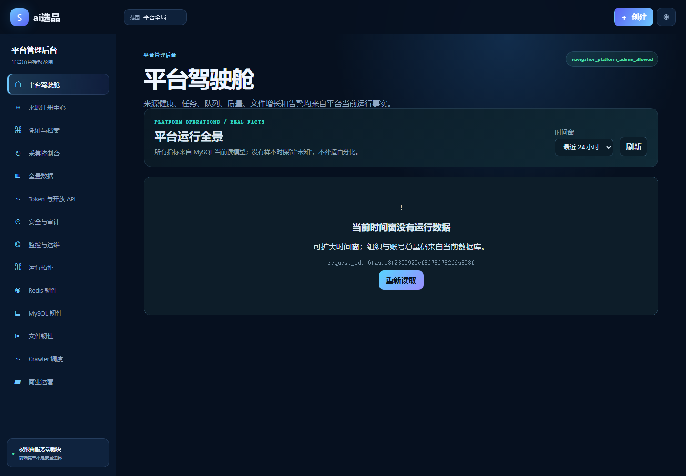
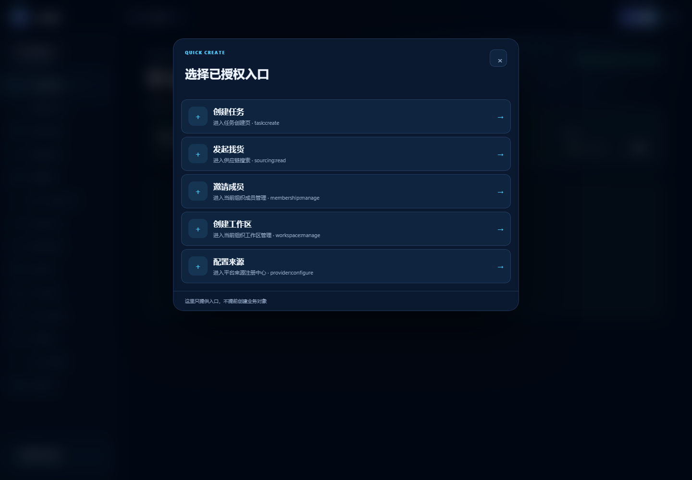
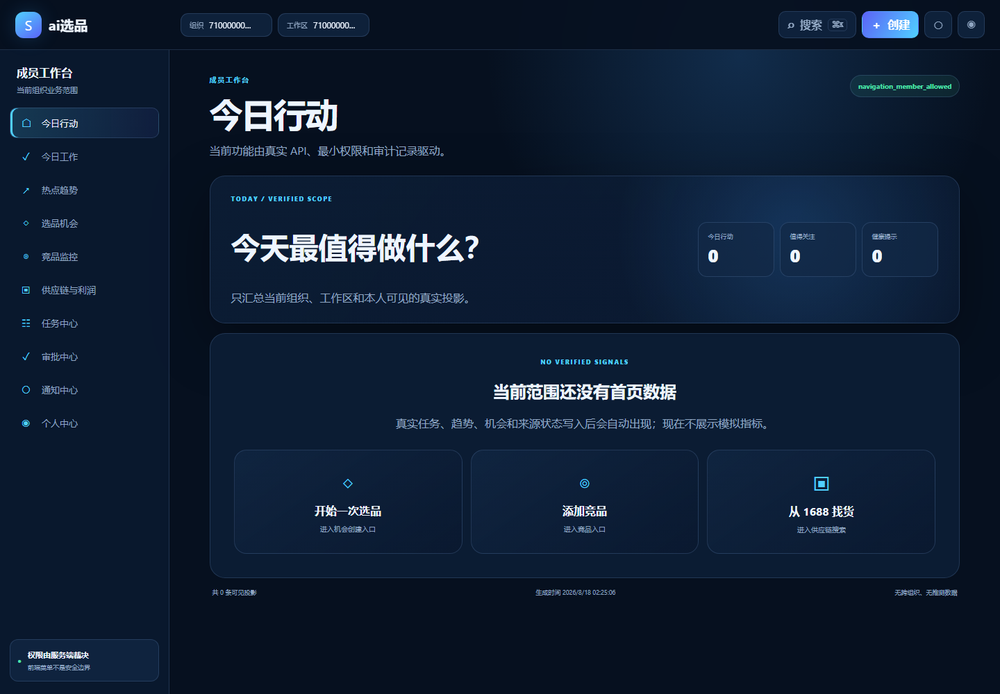
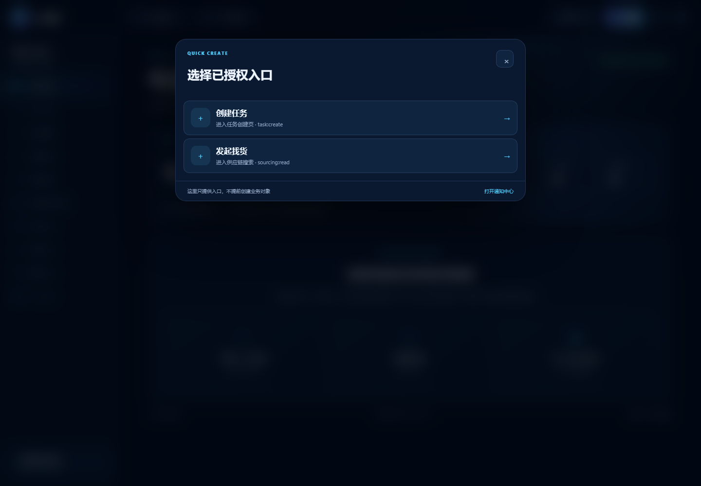
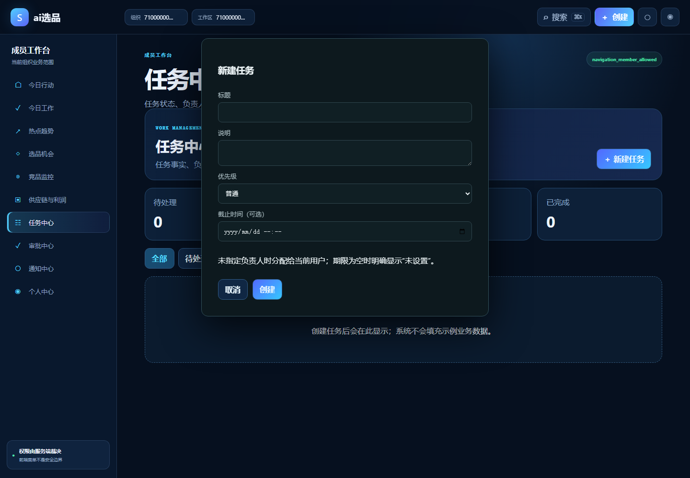
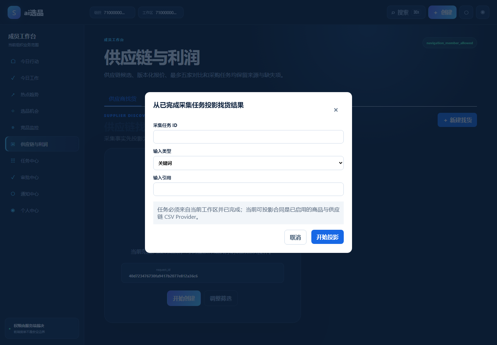

# ai选品上线使用指南

## 1. 登录与自动入口

打开 `https://midouai.medouai.com`。未登录用户会进入登录页；登录成功后，系统根据服务端真实角色自动跳转：平台管理员进入“平台驾驶舱”，普通成员先选择组织和工作区，再进入“今日行动”。新账号没有组织时，点击“创建并进入选品空间”，系统会建立仅属于该账号的个人组织、默认工作区和组织管理员权限，并直接进入工作台；不需要等待平台管理员手工分配。

## 2. 平台管理员

平台管理员可从左侧菜单进入来源注册、凭证档案、采集控制台、全量数据、安全审计、监控运维和商业运营。顶部“创建”只展示当前账号有权执行的操作。

## 3. 普通成员工作台

成员选择组织和工作区后进入“今日行动”，可以继续访问今日工作、热点趋势、选品机会、竞品监控、供应链与利润、任务、审批、通知和个人中心。页面只展示当前组织、工作区及本人权限范围内的真实数据；无数据时提供直接开始选品、添加竞品和找货入口。

顶部“创建”会根据权限显示创建任务和发起找货，不再出现通用 `ERROR`。

## 4. 自动选品与最终采纳

在首页直接填写市场、商品关键词、排除词、采集周期和“进入推荐所需独立来源数”，保存后系统立即开始持续采集公开页面。真实商品证据命中规则但尚未达到来源门槛时进入“自动补证中”；达到用户设置的来源门槛后进入“待我采纳”。系统不会因此编造分数、利润或风险；如工作区另有已启用评分规则，其版本化评分结论优先。打开推荐核对证据后，由人工选择采纳、观察或驳回，系统不会自动替你采纳。

“全部机会”用于查看手工添加、ERP 导入和尚未形成推荐的其他线索。高级筛选默认收起，只有需要按市场、证据完整度、阶段或负责人缩小时再打开。

## 5. 创建任务

点击“创建任务”后填写标题、说明、优先级和可选截止时间。未指定负责人时系统分配给当前用户；截止时间为空时明确显示“未设置”。

## 6. 发起找货

找货从已经完成的采集任务投影结果，选择输入类型并填写引用。只有当前工作区已完成且来源已启用的任务可进入后续供应商对比与采购任务流程。

## 7. 验收与故障定位

发布前先执行 `npm run build` 和 `npm run verify:functional`。生产站点使用六个专用临时账号执行 `npm run verify:production-product`，账号分别只能拥有普通成员、选品经理、组织管理员、平台运营管理员、平台安全管理员和平台超级管理员角色。账号和密码只通过 `config/env.example` 中的 `SCOUTOPS_QA_*` 变量注入，不写入 Git、截图或报告。

脚本直接解析 `apps/web/src/route-catalog.ts`，按每个账号从 `/api/v1/me/navigation` 取得的真实能力计算全部授权路由，不再只遍历侧栏菜单。每个静态路由都必须打开；机会详情和任务详情必须从验收组织的真实列表取得一条已持久化记录后打开。它同时阻断角色叠加、越权能力、Route Catalog 漏测、API 4xx/5xx、控制台错误、阶段占位页、会话丢失以及失效的快捷创建入口。生产报告只保存角色、能力、路由与错误事实，不保存邮箱、密码或 Cookie。

生产目录固定为 `/www/wwwroot/ai选品/frontend`（Vue 网站）、`backend`（Node 项目“ai选品”）、`python`（Python 3.12 项目“ai选品-python”）、`config/runtime/backups`。健康检查使用 `/api/v1/health/live`、`/api/v1/health/ready` 和 `/api/v1/health/version`。统一 Node 后端监督 API/Worker，宝塔分别负责网站、Node 和 Python 的启动、停止、重启和日志；服务器不使用 Git 或 `current/releases`。

验收结束必须删除临时账号、会话、组织、工作区和关联测试数据，并删除宝塔一次性任务、一次性脚本、本地 `.artifacts` 报告和浏览器控制目录。
